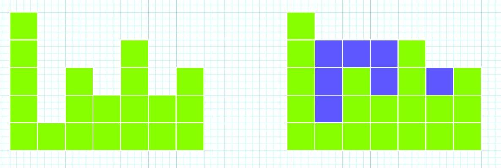

# UCU final exam preparation

## Here you can see different preparation tasks. First and second are easy, third and fourth are harder. To test your solutions clone this repo and write your code in solutions/task_name.py file, then start ./check.sh
---
## Aliens
### Statement
Yesterday UCU CS students developed a warp engine and traveled millions of light-years. After the long journey, they finally meet aliens. To prove intelligence students are required to pass a test. Unfortunately, they skipped some of Romanyuk's classes, so they are not familiar with number systems. The statement of a test is follows:
You're given an integer ```n```, find count of number systems, that are less than ```n``` and in which representation of integer ```n``` is a palindrome. As an example, for integer 9 you should return 2 since in binary system ```9=0b1001``` is a palindrome and in octal system ```9=011``` is a palindrome. The decimal number system doesn't count because 10 is not less than 9.
### Details
You should develop a ```calc_systems_count(num: int) -> int``` function that takes a ```num``` as a parameter and returns number of systems that are less than ```num``` and in which representation of ```num``` is a palindrome. Examples:
```python
calc_systems_count(9) -> 2 # (2, 8) number systems
calc_systems_count(20) -> 3 # (3, 9, 19) number systems
calc_systems_count(98) -> 5 # (5, 6, 13, 48, 97) number systems
```
## Internet
### Statement
You are familiar with the internet at UCU Collegium. To convince the administration to fix it, you will need strong evidence of its slow speed. The only thing you can use is the maximum waiting time of all user requests, aka non-canonicity of the internet. At each second, the internets router receives a request from someone or sends a response to someone. User wait time is the difference between a request from the user and a response to the user. As shown in the example above, the wait time of Alex's response is 3 since the request was made at 1st second and response at 4th second. It's guaranteed that for each request, there's a response. Note that the same user can send more than one request. As shown in the example above, Oleg sends two requests on the 5th and 7th seconds. In that case, the first response to Oleg will be to his earliest request (5th second).
### Details
You should develop a ```get_noncanonicity(timeline: List[Tuple[str, str]]) -> int``` function that takes a router timeline and returns the non-canonicity of the internet. For example the input can be as follows:
```python
[('REQUEST', 'Alex'),
 ('REQUEST', 'Yurii'),
 ('REQUEST', 'Stepan'),
 ('RESPONSE', 'Alex'),
 ('REQUEST', 'Oleg'),
 ('RESPONSE', 'Stepan'),
 ('REQUEST', 'Oleg'),
 ('REQUEST', 'Bogdan'),
 ('RESPONSE', 'Oleg'),
 ('RESPONSE', 'Bogdan'),
 ('RESPONSE', 'Oleg'),
 ('RESPONSE', 'Yurii')]
```
And the output should be 10, since Yurii waited 10 second to get a response.
## Islands
### Statement
Nowadays, people become more and more greedy, so everyone will need his own island to live on. You're given a 2D grid representing the map with each field as zero (water), or one (ground). Each island is surrounded by water and is formed by connecting adjacent lands horizontally or vertically. You may assume all four edges of the grid are all surrounded by water. The prime minister asked you to denote every field by the unique "id" of island to which it belongs. Every "id" should be a positive integer. The example is given below.
### Details
You should develop a ```mark_islands(matrix: List[List[int]]) -> List[List[int]]``` function that takes a matrix parameter and returns matrix of id's. For example the input can be as follows:
```python
[[1,0,0,1,1,1,1,0],
 [1,1,0,0,0,1,0,0],
 [0,1,0,1,1,1,0,0],
 [1,0,1,1,0,0,0,0],
 [1,0,0,0,0,1,0,0],
 [1,0,1,1,0,1,0,0],
 [1,0,0,1,0,1,1,1],
 [1,1,1,1,0,0,0,0]]
```
And the output as follows:
```python
[[1,0,0,2,2,2,2,0],
 [1,1,0,0,0,2,0,0],
 [0,1,0,2,2,2,0,0],
 [3,0,2,2,0,0,0,0],
 [3,0,0,0,0,4,0,0],
 [3,0,3,3,0,4,0,0],
 [3,0,0,3,0,4,4,4],
 [3,3,3,3,0,0,0,0]]
```
## Flood
### Statement
Today you were preparing for the final programming exam when somebody approached you in the Trapzena and intrigued you with an exciting task (maybe it's professor Scherbyna, but I'm not sure). The statement is as follows: you are given a ```n```-length list of positive integer heights. This list represents ```n``` columns that are standing on the ground. Your task is to determine how much water we can fill in this 2D grid that is formed by these columns. Note that water should not flow out. See the example below.
### Details
You should develop ```get_amount_of_water(heights: List[int]) -> int``` function that takes a list of heights as a parameter and returns the amount of water that you can fill into it.
For example, if the array is [5, 1, 3, 2, 4, 2, 3] we can fill 7 units of water. Character 'w' in the example denotes water.
```
 █                    => █
 █           █        => █  W  W  W  █        
 █     █     █     █  => █  W  █  W  █  W  █  
 █     █  █  █  █  █  => █  W  █  █  █  █  █  
 █  █  █  █  █  █  █  => █  █  █  █  █  █  █
 5  1  3  2  4  2  3  =>   +3 +1 +2    +1     = 7
```

